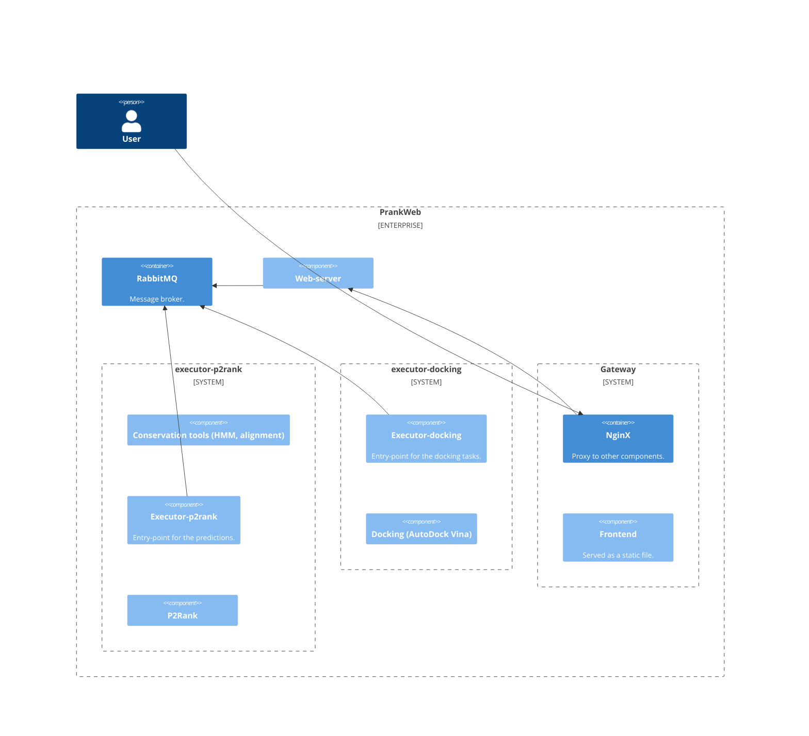
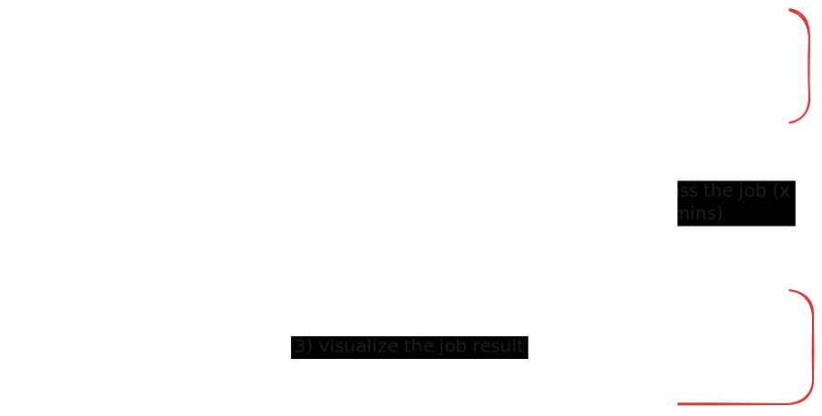

# Visualization of task results

## Introduction & motivation

The primary purpose of PrankWeb is to provide a user-friendly interface for the P2rank prediction of protein binding sites. We have designed the application in a way that also allows post-processing of the prediction results. This includes the possibility to perform additional computations on the server and visualize the results in the application. These additional post-processing tasks are available in the "Tasks" tab on the right side of the application while viewing a prediction.

As an example, we have previously succesfully implemented a task type that allows the user to perform molecular docking of a ligand to a protein structure. This is a complicated computation that needs to be run on a server.

The problem with docking was that the docking results had to be downloaded and viewed in a separate application. This is not user-friendly and requires additional steps. This issue would be present for any complex tasks which would result in more data to be visualized, such as histograms, big tables, charts, etc. - the computation results might be too large to be displayed in the main application.

To address this type of issue, we have implemented a new, generic feature in PrankWeb that allows the user to visualize the results of additional tasks directly in the application by clicking a button in the task list.

We have prepared an architecture that allows visualization of additional task results of any format in a dedicated window. The data can be displayed in the form of a table, chart, or any other visualization.

## Architecture

To introduce a new post-processing task type to PrankWeb, one has to integrate it into the existing architecture, including both frontend and backend. This process is not simple and requires further reading - see [the section 3.3.2 of this document](https://dspace.cuni.cz/bitstream/handle/20.500.11956/183085/130359073.pdf?sequence=1&isAllowed=y) to get a better understanding of the architecture. On the other side, once the task is integrated and the results might be downloaded via simple API calls (or passed through parameters in JSON format), the visualization can be implemented in a few simple steps.

This is a simplified look at the current PrankWeb architecture (not considering external services and monitoring tools):

The user connects to a web-server that serves the frontend part of the application. The frontend part is then making API calls handled by a RabbitMQ broker, which is connected to multiple services that handle the execution of both predictions and additional tasks. The results are then passed back to the frontend part of the application.

To view the entire architecture, see the [full architecture diagram](https://github.com/cusbg/p2rank-framework/wiki/PrankWeb-architecture).

Let's take a look at the current implementation of the docking task visualization.

## Docking task visualization

Currently, we have implemented a visualization of docking results in the form of a Mol* viewer similar to the one used in the main application. The main reason for this that the docking results might be shown in a similar way as the P2rank predictions. However, as it would be complicated to show the docking results in the main application, we have decided to show them in a separate window.

This vastly improves the user experience as the user can view the docking results directly in the application without the need to download them and open them in a separate viewer. It also provides a consistent user experience as the docking results are shown in a similar way as the P2rank predictions.

The workflow for the docking task is as follows:

1. The user views a P2rank prediction in the main application.
2. In the tab on the right, the user creates a new docking task with a specified ligand in the form of a SMILES string.
3. The user submits the docking task. This computation is performed on the server and takes some time.
4. After successful task completion, the user can view the docking results by clicking the "eye" icon in the task list.

This is how the architecture works:

## What has changed?

Let's take a look at the picture once again, but this time with colors:
- Blue color represents the main application. This is the key part of the PrankWeb application that is used to view P2rank predictions.
- Red color represents additional tasks. In this case, the docking task is shown. This part of the application is used to perform additional computations on the server. Keep in mind that this part might be implemented in the main application on client-side for quick computations.
- Green color represents the newly introduced visualization feature. This part of the application is used to visualize the results of additional tasks. The data is then displayed in a dedicated window.

The main goal was to introduce a way that allows an easy way to show the results of any additional tasks in the application. This is achieved by the newly introduced visualization feature. The feature is generic and can be used to visualize any type of data.

The feature is implemented in the `visualize` directory in the frontend part of the application. The directory contains the following files:
- `app.tsx` - the main file that contains the `MainVis<T>` component. This component is used to render the visualization in a dedicated window.
- `visualize.ts` - the file that contains the `getData` method. This method is used to fetch the data from the server. It also server as an entry point for the visualization.
- `visualize.html` - the HTML file that serves as a template for the visualization window.
- `docking` - a directory that contains the implementation of the docking visualization. This directory is an example of how to implement a new visualization.

The three newly introduced files are used to implement the visualization feature. The only other change to the frontend part of the application is a change of the `server/server.develop.js` file, where a new route is added to the server that serves the visualization window.

## How to add a new visualization type

Adding a new visualization is rather simple. Here is a step-by-step guide:

1. Implement a method to fetch the data from a server. Currently, a task result is identified by the following data: 
- `type: string` - the type of the task (e.g. `docking`)
- `id: string` - the ID of the prediction (e.g. `2SRC`)
- `database: string` - the database of the prediction (e.g. `v3`)
- `hash: string` - the hash of the task (e.g. a MD5 hash)
- `structureName: string` - the name of the structure (e.g. `structure.cif`)

This combination of data is unique for each task and can be used to fetch the results from the server. This means one can create a request with the following URL: `.../visualize?type=docking&id=2SRC&database=v3-conservation-hmm&hash=b4beaaf3debf2470efd556ac5e9a4187&structureName=structure.cif`

The method then should be called by the `getData` method in the `visualize/visualize.ts` file. The method should return a promise that resolves to the data that will be used for visualization. There are no strict requirements for the data format.

2. Implement a method to visualize the data. The method should be called by the `render` method in the `visualize/app.tsx` file. In this file, the `MainVis<T>` component expect two parameters: `data: T` and `type: string`. The `data` parameter is the data fetched from the server in the first step, and the `type` parameter is the type of the visualization. The method should return a React component that will be rendered in the dedicated window.

3. Implement a custom component that will take `data` as a parameter and visualize it. It is recommended to create a subdirectory in the `visualize` directory with the name of the visualization.