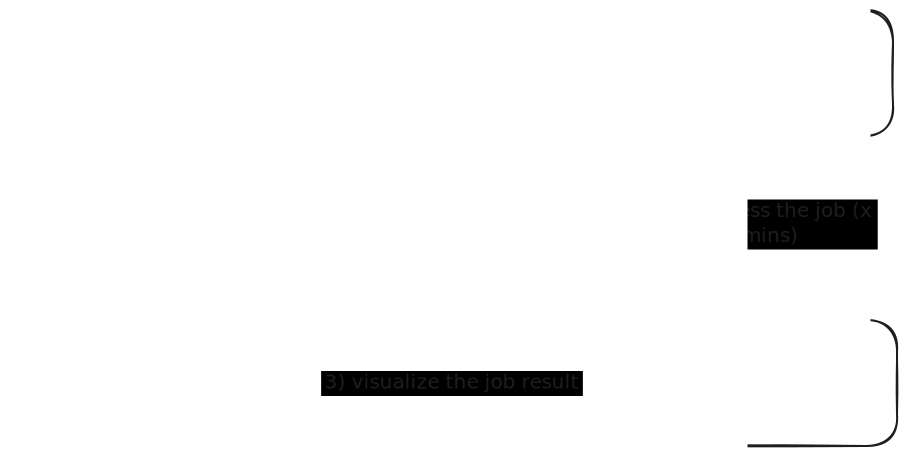

# Visualization of task results

We have prepared an architecture that allows visualization of additional task results of any format in a dedicated window. The data can be displayed in the form of a table, chart, or any other visualization.

Currently, we have implemented a visualization of docking results in the form of a Mol* viewer similar to the one used in the main application. The workflow is as follows:

1. The user views a P2rank prediction in the main application.
2. In the tab on the right, the user creates a new docking task with a specified ligand in the form of a SMILES string.
3. The user submits the docking task. This computation is performed on the server and takes some time.
4. After successful task completion, the user can view the docking results by clicking the "eye" icon in the task list.

This is how the architecture works:

## How to add a new visualization

Adding a new visualization is rather simple. Here is a step-by-step guide:

1. Implement a method to fetch the data from a server. Currently, a task result is identified by the following data: 
- `type: string` - the type of the task (e.g. `docking`)
- `id: string` - the ID of the prediction (e.g. `2SRC`)
- `database: string` - the database of the prediction (e.g. `v3`)
- `hash: string` - the hash of the task (e.g. a MD5 hash)
- `structureName: string` - the name of the structure (e.g. `structure.cif`)

This combination of data is unique for each task and can be used to fetch the results from the server. This means one can create a request with the following URL: `.../visualize?type=docking&id=2SRC&database=v3-conservation-hmm&hash=b4beaaf3debf2470efd556ac5e9a4187&structureName=structure.cif`

The method then should be called by the `getData` method in the `visualize/visualize.ts` file. The method should return a promise that resolves to the data that will be used for visualization. There are no strict requirements for the data format.

2. Implement a method to visualize the data. The method should be called by the `render` method in the `visualize/app.tsx` file. In this file, the `MainVis<T>` component expect two parameters: `data: T` and `type: string`. The `data` parameter is the data fetched from the server in the first step, and the `type` parameter is the type of the visualization. The method should return a React component that will be rendered in the dedicated window.

3. Implement a custom component that will take `data` as a parameter and visualize it. It is recommended to create a subdirectory in the `visualize` directory with the name of the visualization.